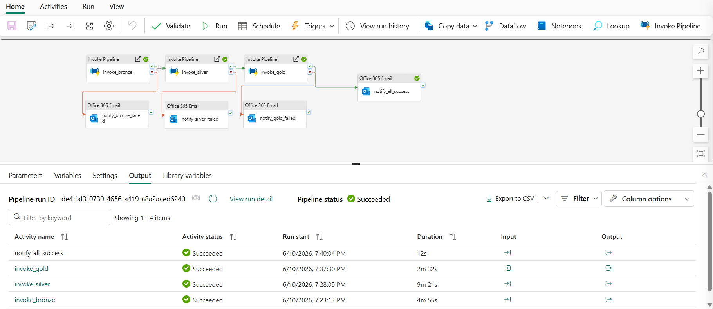
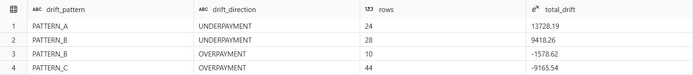
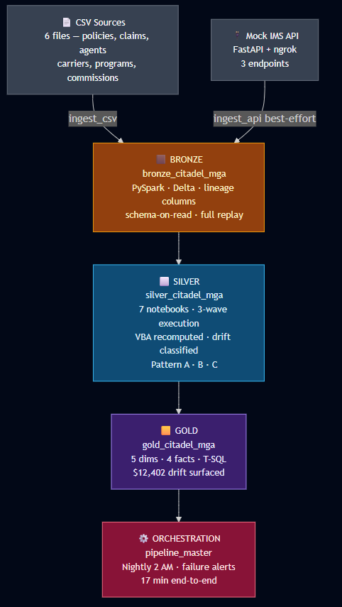
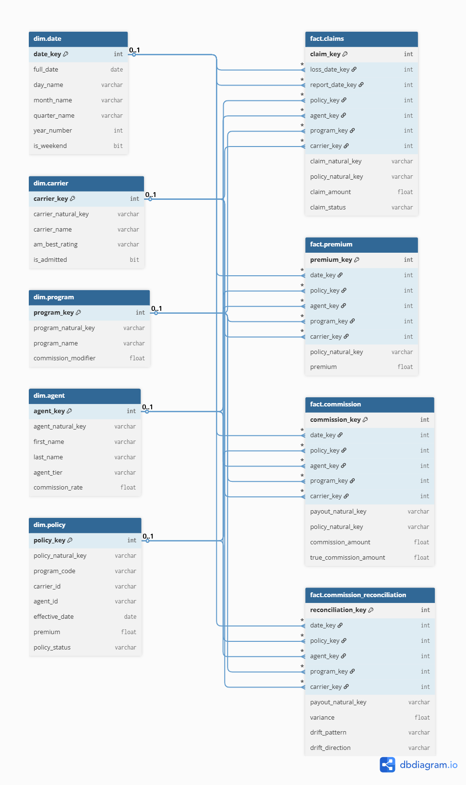
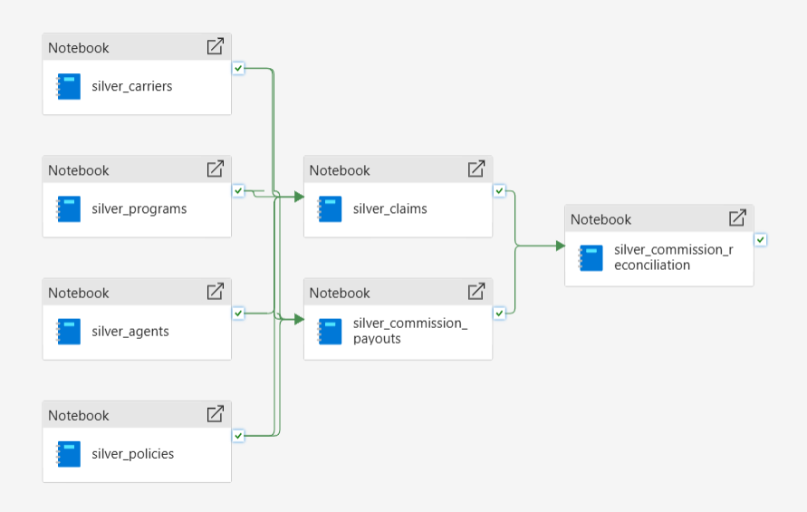

# Specialty Insurance MGA: Fabric Medallion Lakehouse

An end-to-end Microsoft Fabric data platform that rebuilds a 15-year-old Excel VBA commission tool as a governed lakehouse, then reconciles the two and finds **$12,402 in commission drift** the old tool had been producing for years.

This started as a prototype for a Data Warehouse Engineer role at a specialty insurance MGA. The design generalizes to any program manager running policy administration on something like Vertafore IMS, with reporting held together by legacy spreadsheet tooling and one person who knows how it all works.

<p align="center">
  
  <br/>
  <em>One verified end-to-end run: bronze, silver, gold, success email. 17 minutes.</em>
</p>


---

## The problem this models

A common setup at specialty insurance MGAs:

- A policy admin system (Vertafore IMS) is the system of record. A third-party vendor manages the SQL Server warehouse behind it. The MGA has read-only access.
- A 15-year-old Excel VBA tool pulls from that warehouse, calculates agent commissions, and pushes results into the ERP. One employee owns it. There is no documentation. He does not want to train anyone.
- SaaS data sits in disconnected tools, so nobody can build end-to-end reporting.

The technical debt is annoying. The real risk is worse: the commission logic is unauditable. Nobody can prove agents are being paid correctly, and small errors compound quietly over fifteen years.

So I rebuilt that environment as a lakehouse and made it catch exactly the kind of error the VBA tool hides.

---

## The headline number

The synthetic commission data was generated with drift planted at the source, simulating what a stale VBA lookup sheet actually does in production. After rebuilding the commission logic correctly in the silver layer and reconciling:

| Metric | Value |
|---|---|
| What the VBA tool paid | $11,457,800.54 |
| What it should have paid | $11,470,202.86 |
| Net drift | **-$12,402.32** |

Here is the trap: -$12,402 against $11.4M is roughly 0.1%. No financial review will ever flag that. But the net hides the gross. Underneath it are ~$21K in underpayments to agents who were owed more, and ~$9K in overpayments to agents who never qualified for a bonus. The errors partially cancel in aggregate and persist per-agent.

That is why the tool ran fifteen years without anyone noticing. Surfacing it is the whole point of the platform.

<p align="center">
  
  <br/>
  <em>fact.commission_reconciliation grouped by drift_pattern and drift_direction.</em>
</p>

---

## Architecture

**Stack:** Microsoft Fabric, PySpark (bronze and silver), T-SQL (gold warehouse), Fabric Data Pipelines, FastAPI for the mock source API, Git for version control.

<p align="center">
  
  <br/>
  <em>Full medallion flow from source to warehouse.</em>
</p>

---

## Bronze: land it raw, tag everything

Six CSVs plus a three-endpoint mock API land as Delta tables. Bronze does zero transformation. If silver logic changes next month, bronze can replay everything.

Every row carries lineage columns: ingestion timestamp, batch ID, source endpoint, and an `_ingestion_method` flag that marks each row as `csv` or `api`. Silver unions both sources later and you can always tell where a row came from.

The mock API is a FastAPI app exposed through an ngrok tunnel so cloud-hosted Fabric can reach a process running on my laptop, simulating an on-prem IMS endpoint.

---

## Silver: where the VBA gets rebuilt

Silver is the centerpiece. Three decisions matter most here.

**Rejects are quarantined, not dropped.** Rows that fail data quality or referential integrity checks go to `silver_<entity>_rejects` tables instead of vanishing. A claim pointing at a policy that does not exist is broken data. It gets rejected hard and kept where someone can inspect it.

**The commission engine computes everything twice.** The VBA logic was reverse-engineered into five named rules: tier rate, program modifier, volume bonus, status multiplier, and a ceiling. For each payout, silver stores what the VBA recorded (`commission_rate`, `program_modifier`, ...) and what the value should have been (`true_tier_rate`, `true_program_modifier`, ...) side by side on the same row. Every drift question becomes a one-line subtraction. No self-joins.

**Drift was planted in the source data, not the transformation.** The errors live in the data generation script, because that is where they live in real life: a stale lookup sheet produces wrong data at creation time. If I had patched drift in during transformation, the reconciliation would be theater. The platform has to *discover* the error.

Three planted bug patterns, each modeling a real VBA failure mode:

| Pattern | Real-world cause | Effect |
|---|---|---|
| A | Stale hardcoded tier-rate lookup sheet | Underpayment |
| B | Program modifier silently defaulted to 1.0 | Underpayment |
| C | Volume bonus paid to agents who no longer qualify | Overpayment |

### The lesson I got wrong first

Silver writes a dedicated `silver_commission_reconciliation` table that pre-classifies every drift row with a pattern label and a direction. When I built the gold layer, I initially tried to re-derive those labels with my own WHERE clauses. My counts came back 26/40/46. Silver said 24/39/44.

Silver was right. My queries caught supersets, including five rows where the VBA inputs were wrong but both commission amounts were zero. No money moved, so silver correctly excluded them as non-impactful. The rule that came out of this: **when silver pre-classifies rows for analytics, gold preserves the labels. It does not re-derive them.**

<p align="center">
  
  <br/>
  <em>The VBA tool, every quarter, for fifteen years.</em>
</p>


---

## Gold: a star schema that respects Kimball

Five dimensions (`dim.date`, `dim.carrier`, `dim.program`, `dim.agent`, `dim.policy`) and four facts:

| Fact | Grain | Rows | Notes |
|---|---|---|---|
| `fact.premium` | One row per policy | 9,709 | $239M total premium |
| `fact.claims` | One row per claim | 1,977 | 13.6% loss ratio |
| `fact.commission` | One row per payout | 4,977 | VBA values and corrected values side by side, 26 columns |
| `fact.commission_reconciliation` | One row per drift | 106 | Pattern and direction as first-class columns |

Patterns worth pointing at:

- **Surrogate keys via ROW_NUMBER().** Fabric Warehouse does not support IDENTITY columns, so keys are generated with `ROW_NUMBER() OVER (ORDER BY natural_key)` at load time.
- **Degenerate dimensions.** Natural keys like `policy_natural_key` ride directly on fact rows, the standard Kimball treatment for transaction-grain facts. You can filter facts by business key without a dim join.
- **Role-playing dates.** `fact.claims` joins `dim.date` twice, once for loss date and once for report date. That one conformed dimension gives you loss-to-report lag analysis (about 30 days average in this data) for free.
- **Keys inherited through traversal.** Silver claims do not carry agent, program, or carrier IDs. The gold load resolves them through `dim.policy`, the same way the business actually thinks about it: the claim belongs to a policy, the policy belongs to an agent.

<p align="center">
  
  <br/>
  <em>Gold warehouse model view: 5 dims, 4 facts.</em>
</p>

---

## Orchestration: four pipelines, one schedule

The notebooks and SQL do not run themselves. Four Fabric Data Pipelines wire it together.

**pipeline_bronze.** CSV and API ingestion run in parallel because they are independent sources writing to different tables. The API activity is wrapped in best-effort tolerance: if the mock API is down, the notebook catches the exception, logs a warning, and exits clean. Bronze still completes on CSV data and downstream layers run. Pipeline reliability and data freshness are different concerns, and this design separates them.

**pipeline_silver.** Seven notebooks in three waves. Wave 1 (carriers, programs, agents, policies) runs fully parallel. Wave 2 (claims, commission payouts) waits for Wave 1, because claims validates FKs against silver policies and the payout calc reads agents, programs, and policies. Wave 3 (reconciliation) waits for Wave 2. The waves are enforced with dependency arrows, not by hoping the timing works out.


*Suggested: the pipeline_silver canvas showing the three-wave layout, plus the run output where Wave 1 starts at the same second and Wave 2 starts three minutes later.*

**pipeline_gold.** Two Script activities in sequence: dims load first, then facts, because the fact INSERTs INNER JOIN against the dims. Loads use TRUNCATE then INSERT, which is the right call when silver emits complete snapshots at this volume. The first test run accidentally executed both in parallel because I forgot the dependency arrow. It happened to succeed on timing luck. The arrow went in immediately after, because "happened to work" is not a dependency strategy.

**pipeline_master.** Invokes bronze, then silver, then gold, each gated on the previous one succeeding. Every layer has a failure branch that sends an email with the run ID, a timestamp, and the actual error message pulled from `@{activity('...').error.message}`. A final success email confirms end-to-end freshness. Scheduled nightly at 2 AM, the classic batch window: source systems close out end-of-day around midnight, the pipeline gets a two-hour buffer, and data is fresh before anyone logs in.

<p align="center">
  
  <br/>
  <em>Me / building pipelines with dependency arrows / "just run the notebooks manually in order"</em>
</p>

---

## Honest edges

Real platforms have rough edges. Hiding them is worse than documenting them.

**The 23-row gap.** 23 of 5,000 commission payouts reference policy IDs that do not exist in silver policies. That is a referential integrity gap inside silver itself, caught by the INNER JOINs at gold load time. So `fact.commission` carries 4,977 rows, and the reconciliation fact carries 106 instead of 107 (one ~$82 overpayment rode out with its orphaned policy). Every missing row traces to the same root cause, and it is documented in the SQL file headers. Real data has gaps. A platform that surfaces them honestly is worth more than one that absorbs them silently.

**Fabric Warehouse T-SQL is not SQL Server.** Constraints found the hard way:

| Constraint | Workaround |
|---|---|
| No IDENTITY columns | ROW_NUMBER() over the natural key |
| No recursive CTEs | Cross-join digits tally for the date spine |
| FORMAT() unreliable | Date keys computed arithmetically |
| No INFORMATION_SCHEMA | sys.schemas, sys.columns, sys.types |
| GETDATE() returns DATETIME, which inserts reject | SYSDATETIME() returns DATETIME2 |
| PK constraints must be NOT ENFORCED | Declared NONCLUSTERED, NOT ENFORCED |

---

## Scoped out on purpose

Documented as design rather than built, to keep the prototype focused:

- **Event-driven API ingestion.** The batch path is built and scheduled. The production design for the API path is event-triggered: source pushes to a Fabric eventstream, which fires bronze ingestion on arrival. The mixed cadence (scheduled batch plus event-driven real-time) is the correct production target; maintaining tunnel uptime for a demo is not.
- **Incremental loads and SCD2.** TRUNCATE plus reload is valid while silver emits full snapshots at this scale. At production volume this becomes MERGE-based incremental loading, with SCD Type 2 on the slowly changing dims like agent tier.
- **Power BI semantic model** over the gold star schema via Direct Lake: executive, operations, and program performance pages.

---

## Repo layout

```
fabric-insurance-mga-lakehouse/
|-- data-generation/        synthetic data with planted drift (Python + Faker)
|-- notebooks/
|   |-- bronze/             CSV + API ingestion (PySpark)
|   |-- silver/             7 cleansing / DQ / VBA-replication notebooks
|-- sql/gold/               numbered DDL + load scripts (01-10)
|-- pipelines/              4 exported pipeline definitions (JSON)
|-- docs/                   business logic registry, data dictionary
|-- screenshots/            pipeline runs, star schema, reconciliation
```

---

## What this demonstrates

Built vertically: one entity flowed bronze to silver to gold before the next one started. Along the way:

- Medallion architecture on Microsoft Fabric, end to end, orchestrated and scheduled
- Reverse-engineering undocumented legacy logic into explicit, dual-computed, auditable rules
- Kimball dimensional modeling with the actual patterns: degenerate dims, role-playing dates, surrogate keys, conformed dimensions
- Production orchestration habits: parallel where independent, sequenced where dependent, graceful degradation, failure alerting with real error capture
- Working inside platform constraints instead of pretending they do not exist
- Treating data quality findings as platform output, not embarrassment